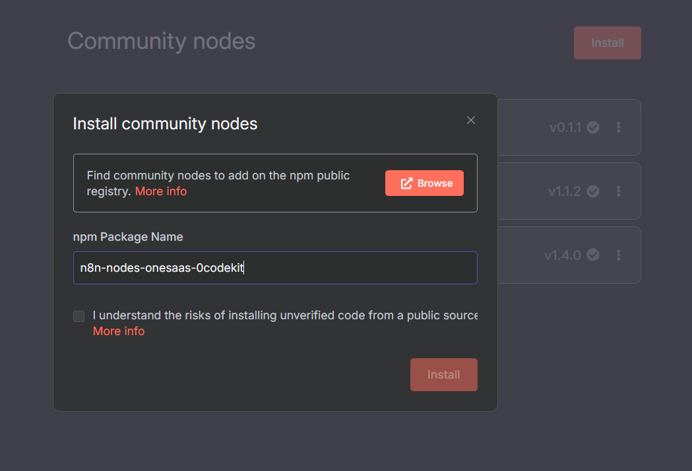

# Setup

To install a community node from npm:

1. Go to **Settings** > **Community Nodes**.
2. Select **Install**.
3. type: n8n-nodes-onesaas-0codekit in npm package name and install

<figure><figcaption></figcaption></figure>

Now you can add the 0Codekit Node to your workflows. :tada:&#x20;

