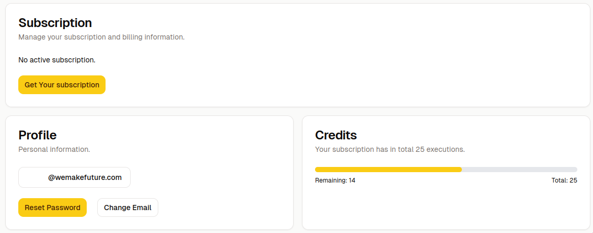

# 👏 Credits, Account & Prices

Can I use 0CodeKit for free?

Yes, the standard free account includes 250 credits per month**.**

By signing up here: [(https://my.0codekit.com/en/auth/login)](https://my.1saas.co) you automatically get 250 credits for free every month!

## What happens when I run out of executions?

At the beginning of the new billing cycle, we will reactivate your subscription, and you can use 0CodeKit again.

**You can upgrade** 0CodeKit in your client portal to a higher plan. The remaining executions will be added to your account as long as your remaining subscription period lasts.

<figure><figcaption></figcaption></figure>

## Can I get a discount for 0CodeKit?

YES ❤️ join our Slack and work with us to bring you new functions. We constantly ship new features. Every idea matters! We honor this with a 20% for our first 1000-Slackers.


You will find the discount code in the #General description - have fun!




### Can I purchase credits before the next subscription period starts?

Yes, if you have a subscription, you can buy on-demand credits anytime you need from your 0CodeKit account.

How? Simply click "add more credits" in the credit section on your account page.

With more credits, you'll have the capacity for more projects, simulations, and productivity. Explore, maximize usage, streamline workflows and empower yourself with 0codekit.

Your feedback drives our improvements - so, let us know what you think. Thanks for trusting us!
